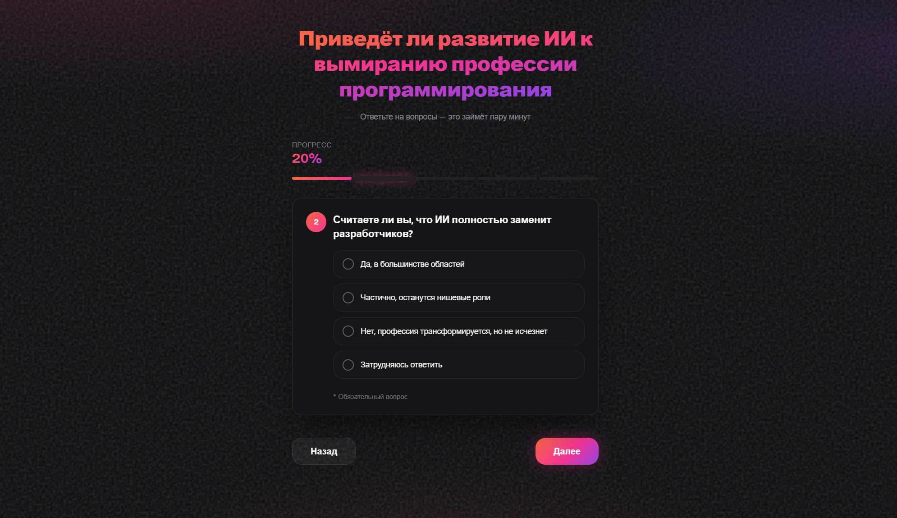

# Мини-анкета

Full-stack приложение для проведения опроса: backend на Node.js (Express + TypeScript) и frontend на React (Vite + shadcn/ui).

Пользователь открывает веб-интерфейс, загружает вопросы с сервера, заполняет анкету (открытые вопросы, один вариант, несколько вариантов) и отправляет ответы. Ответы сохраняются на диске в JSON-файлах вместе со снимком вопросов на момент отправки.



## Задание и промпты

- [Домашнее задание](source_task.md)
- [Промпт 01](prompts/prompt_01.md)
- [Промпт 02](prompts/prompt_02.md)
- [Промпт 03](prompts/prompt_03.md)
- [Промпт 04](prompts/prompt_04.md)
- [Промпт 05](prompts/prompt_05.md)

## Структура проекта

```
task_1/
├── backend/          # API, data/questions.json, answers/
├── frontend/         # React UI
├── scripts/          # Скрипты установки и запуска
└── docs/             # Документация
```

## Требования

- Node.js 20+
- npm 10+

## Быстрый запуск

### Windows (PowerShell)

```powershell
.\scripts\setup-and-run.ps1
```

### Linux / macOS

```bash
chmod +x scripts/setup-and-run.sh
./scripts/setup-and-run.sh
```

### Вручную

```bash
npm install
npm run dev
```

После запуска:


| Сервис   | URL                                            |
| -------- | ---------------------------------------------- |
| Frontend | [http://localhost:5173](http://localhost:5173) |
| Backend  | [http://localhost:3001](http://localhost:3001) |


## API

### `GET /api/questions`

Возвращает заголовок анкеты и список вопросов из `backend/data/questions.json`.

### `POST /api/answers`

Тело запроса:

```json
{
  "answers": {
    "q1": "текст",
    "q2": "option-id",
    "q3": ["id1", "id2"]
  }
}
```

Ответ `201`:

```json
{
  "id": "answer-001",
  "message": "Спасибо!"
}
```

Файл ответа создаётся в `backend/answers/answer-NNN.json` и содержит:

- `id`, `submittedAt`, `surveyTitle`
- `questions` — снимок вопросов
- `answers` — ответы пользователя

## Типы вопросов


| type       | UI             | Значение ответа  |
| ---------- | -------------- | ---------------- |
| `open`     | Текстовое поле | `string`         |
| `single`   | Переключатель  | `string` (id)    |
| `multiple` | Чекбоксы       | `string[]` (ids) |


## Редактирование вопросов

Измените файл [backend/data/questions.json](../backend/data/questions.json) и перезапустите backend.
