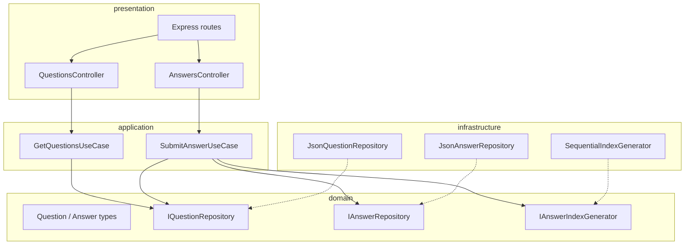
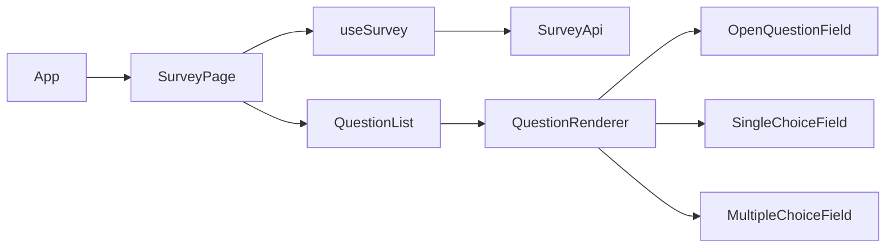

# План реализации мини-анкеты

## Контекст и расхождения с базовым заданием

Базовое ТЗ ([docs/source_task.md](docs/source_task.md)): `GET /questions`, `POST /answers`, React-фронт, «Спасибо!» после отправки.

Ваши дополнения **расширяют** хранение: вместо in-memory slice — **файловое хранение** в `answers/` с индексом и снимком вопросов. Это осознанное отклонение; в [docs/README.md](docs/README.md) кратко укажем это.

**Выборы (подтверждены):** TypeScript, monorepo `backend/` + `frontend/`.

---

## Целевая структура репозитория

```
task_1/
├── package.json                 # workspaces, install + dev
├── scripts/
│   ├── setup-and-run.ps1        # Windows
│   └── setup-and-run.sh         # Linux/macOS
├── backend/
│   ├── package.json
│   ├── tsconfig.json
│   ├── data/questions.json      # 5 вопросов, все 3 типа
│   ├── answers/                 # .gitkeep; runtime JSON
│   └── src/
│       ├── domain/
│       ├── application/
│       ├── infrastructure/
│       └── presentation/
├── frontend/
│   ├── package.json
│   ├── vite.config.ts
│   ├── tailwind.config.ts
│   ├── components.json          # shadcn
│   └── src/ ...
└── docs/
    ├── source_task.md
    ├── implementation_plan.md   # этот план (после подтверждения)
    └── README.md                # описание + запуск
```

---

## Модель данных

### Типы вопросов

| type | UI (shadcn) | Значение в POST |
|------|-------------|-----------------|
| `open` | `Input` / `Textarea` | `string` |
| `single` | `RadioGroup` | `string` (id опции) |
| `multiple` | `Checkbox` (группа) | `string[]` (ids опций) |

### Схема `backend/data/questions.json`

```json
{
  "title": "ИИ и профессия программиста",
  "questions": [
    {
      "id": "q1",
      "type": "open",
      "text": "...",
      "required": true
    },
    {
      "id": "q2",
      "type": "single",
      "text": "...",
      "options": [{ "id": "a", "label": "..." }],
      "required": true
    },
    {
      "id": "q3",
      "type": "multiple",
      "text": "...",
      "options": [{ "id": "x", "label": "..." }],
      "required": false
    }
  ]
}
```

**5 вопросов** на тему «Приведёт ли развитие ИИ к вымиранию профессии программирования»: минимум по одному `open`, `single`, `multiple`; остальные — любые типы для разнообразия.

### Публичный DTO для API (без лишних полей)

`GET /questions` возвращает `{ title, questions }` — те же поля, **без** правильных ответов (анкета, не тест).

### Схема файла ответа `backend/answers/answer-NNN.json`

```json
{
  "id": "answer-001",
  "submittedAt": "2026-05-22T12:00:00.000Z",
  "surveyTitle": "...",
  "questions": [ /* снимок вопросов на момент отправки */ ],
  "answers": {
    "q1": "текст ответа",
    "q2": "option-id",
    "q3": ["id1", "id2"]
  }
}
```

Индекс: трёхзначный автоинкремент (`001`, `002`, …) по существующим файлам в `answers/`.

### Тело `POST /answers`

```json
{
  "answers": {
    "q1": "string",
    "q2": "string",
    "q3": ["a", "b"]
  }
}
```

---

## Backend (Node.js + TypeScript + Express)

### Стек

- **Express** + `cors`, `express.json()`
- **Zod** — валидация тела запроса и типов ответов по `type` вопроса
- **fs/promises** — чтение/запись JSON (без БД)
- Порт по умолчанию: **3001** (чтобы не конфликтовать с Vite **5173**)

### SOLID-слои



| Принцип | Реализация |
|---------|------------|
| **S** | Контроллеры только HTTP; use cases — бизнес-логика; репозитории — I/O |
| **O** | Новый тип вопроса = новая Zod-схема + (при необходимости) валидатор, без правки use case целиком |
| **L** | Репозитории взаимозаменяемы через интерфейсы |
| **I** | Узкие интерфейсы: `IQuestionRepository`, `IAnswerRepository`, `IAnswerIndexGenerator` |
| **D** | Use cases зависят от интерфейсов; wiring в `src/app.ts` / `compositionRoot.ts` |

### Ключевые файлы

| Файл | Назначение |
|------|------------|
| [backend/src/domain/question.ts](backend/src/domain/question.ts) | Типы `Question`, `QuestionType`, `Survey` |
| [backend/src/domain/repositories.ts](backend/src/domain/repositories.ts) | Интерфейсы репозиториев |
| [backend/src/application/getQuestions.ts](backend/src/application/getQuestions.ts) | Загрузка анкеты |
| [backend/src/application/submitAnswer.ts](backend/src/application/submitAnswer.ts) | Валидация + снимок вопросов + сохранение |
| [backend/src/infrastructure/jsonQuestionRepository.ts](backend/src/infrastructure/jsonQuestionRepository.ts) | Чтение `data/questions.json` |
| [backend/src/infrastructure/jsonAnswerRepository.ts](backend/src/infrastructure/jsonAnswerRepository.ts) | Запись `answers/answer-NNN.json` |
| [backend/src/presentation/routes.ts](backend/src/presentation/routes.ts) | `GET /questions`, `POST /answers` |
| [backend/src/app.ts](backend/src/app.ts) | Сборка DI, middleware, error handler |

### API-контракт

- `GET /questions` → `200` + JSON анкеты; `500` при ошибке чтения файла
- `POST /answers` → `201` + `{ id, message }`; `400` при невалидных id/типах/required; `500` при ошибке записи

### Валидация в `SubmitAnswerUseCase`

1. Загрузить актуальные вопросы из репозитория.
2. Проверить: все `required` заполнены; ключи ⊆ id вопросов; тип значения соответствует `open` / `single` / `multiple`.
3. Сформировать payload с **полным снимком** `questions` и ответами.
4. Сгенерировать id, записать файл.

---

## Frontend (React + TypeScript + Vite + shadcn)

### Инициализация

1. `npm create vite@latest frontend -- --template react-ts`
2. Tailwind v4/v3 + `shadcn init` (стиль **default**, base color **slate**, CSS variables)
3. Компоненты shadcn: `button`, `card`, `input`, `textarea`, `label`, `radio-group`, `checkbox`, `sonner` или простой alert для ошибок

### SOLID на фронте



| Принцип | Реализация |
|---------|------------|
| **S** | `QuestionRenderer` — только выбор виджета по `type`; форма — только state/submit |
| **O** | Новый `type` → новый компонент + ветка в renderer (Open/Closed) |
| **L** | Все field-компоненты реализуют общий `QuestionFieldProps` |
| **I** | `SurveyApi` interface + `HttpSurveyApi` implementation |
| **D** | `useSurvey(api: SurveyApi)` — API инжектируется, удобно для тестов |

### Поток UX

1. **Loading** — skeleton или spinner (shadcn-friendly, минимальный).
2. **Form** — карточки вопросов с лёгким `fade-in` / `slide-in` (CSS `@keyframes` или `transition`, без тяжёлых библиотек).
3. **Submit** — disabled button + loading state.
4. **Success** — экран «Спасибо!» с коротким текстом и кнопкой «Пройти снова» (сброс state).
5. **Errors** — сеть/валидация: inline сообщение под формой.

### UI/UX: синяя минималистичная тема

В [frontend/src/index.css](frontend/src/index.css) переопределить CSS variables shadcn:

- Primary: оттенки синего (`hsl(217 …)` / `#2563eb` family)
- Background: почти белый / очень светлый blue-gray
- Accent: светло-голубой
- Radius: умеренный (`0.5rem`)
- Шрифт: system-ui stack
- Анимации: `transition: opacity, transform 200ms ease` на карточках; respect `prefers-reduced-motion`

### Proxy для dev

В [frontend/vite.config.ts](frontend/vite.config.ts):

```ts
proxy: { '/api': 'http://localhost:3001' }
```

API-клиент ходит на `/api/questions` и `/api/answers`; Express монтирует те же пути **или** префикс `/api` на backend — важно согласовать один вариант (рекомендация: backend routes `/api/questions`, `/api/answers`).

---

## Скрипты установки и запуска

### Корневой [package.json](package.json)

- `"workspaces": ["backend", "frontend"]`
- `npm run install:all` — `npm install` в корне (подтянет workspaces)
- `npm run dev` — `concurrently "npm run dev -w backend" "npm run dev -w frontend"`
- `npm run build` — сборка обоих пакетов

### [scripts/setup-and-run.ps1](scripts/setup-and-run.ps1) (Windows)

```powershell
npm install
npm run dev
```

### [scripts/setup-and-run.sh](scripts/setup-and-run.sh) (Unix)

```bash
#!/usr/bin/env bash
set -euo pipefail
npm install
npm run dev
```

Скрипты — тонкая обёртка; основная логика в npm scripts (кроссплатформенно).

---

## Документация

| Файл | Содержание |
|------|------------|
| [docs/implementation_plan.md](docs/implementation_plan.md) | Копия/экспорт этого плана после подтверждения |
| [docs/README.md](docs/README.md) | Назначение приложения, схема API, структура папок, требования (Node 20+), запуск через `scripts/` или `npm run dev`, URL фронта и API, пример `questions.json`, формат файлов ответов |

---

## Порядок реализации (этапы)

### Этап 1 — Каркас monorepo
- Корневой `package.json`, workspaces, `.gitignore` (`node_modules`, `dist`, `answers/*.json` кроме `.gitkeep`)

### Этап 2 — Backend
- Типы, интерфейсы, репозитории, use cases, Express, `questions.json` (5 вопросов по теме ИИ)
- Ручная проверка: `curl GET/POST`

### Этап 3 — Frontend
- Vite + shadcn + тема
- API client, hooks, question components, success screen
- Валидация required на клиенте (дублирует server-side UX)

### Этап 4 — Интеграция
- Proxy, E2E ручной сценарий: загрузка → заполнение всех типов → «Спасибо!» → файл в `answers/`

### Этап 5 — Deploy/DX
- Скрипты `scripts/*`, `docs/README.md`, сохранение плана в `docs/implementation_plan.md`

---

## Пример наполнения questions.json (тема)

1. **open** — «Как вы лично оцениваете риск исчезновения профессии программиста из-за ИИ в ближайшие 10 лет?»
2. **single** — «Считаете ли вы, что ИИ полностью заменит разработчиков?»
3. **multiple** — «Какие задачи программиста, по вашему мнению, ИИ автоматизирует первыми?» (code review, boilerplate, debugging, …)
4. **single** — «Планируете ли вы менять профессию из-за ИИ?»
5. **open** — «Что, на ваш взгляд, останется exclusive за человеком-разработчиком?»

---

## Риски и митигация

| Риск | Митигация |
|------|-----------|
| Race condition при индексе ответов | Для учебного проекта — sequential scan папки; при параллельных POST — optional simple file lock или mutex в process |
| CORS | `cors()` на backend + Vite proxy в dev |
| shadcn + Windows paths | Стандартный CLI shadcn из корня `frontend/` |
| Кодировка JSON | UTF-8, `JSON.stringify(_, null, 2)` для читаемости файлов ответов |

---

## Критерии готовности (Definition of Done)

- [ ] `GET /questions` отдаёт 5 вопросов трёх типов из JSON
- [ ] `POST /answers` создаёт `answers/answer-NNN.json` с вопросами и ответами
- [ ] React UI: open / radio / checkbox, синяя тема, лёгкая анимация
- [ ] После submit — «Спасибо!»
- [ ] `scripts/setup-and-run.*` и `npm run dev` работают на Windows
- [ ] `docs/README.md` и `docs/implementation_plan.md` заполнены
- [ ] Промпты остаются в `prompts/` (по формату сдачи)
